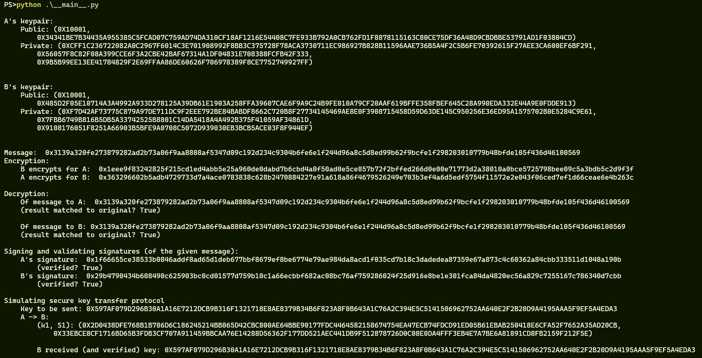
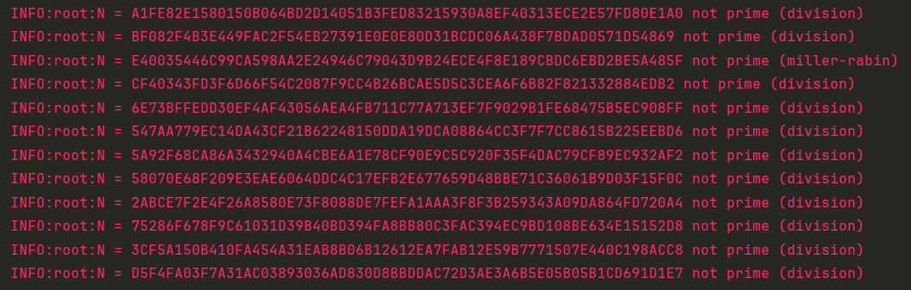
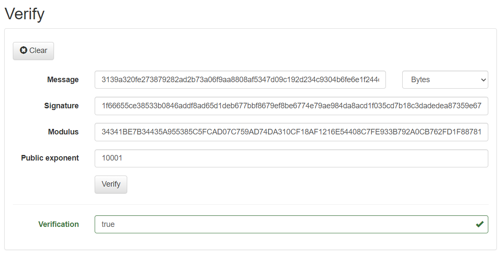

# КРИПТОГРАФІЯ

## КОМП’ЮТЕРНИЙ ПРАКТИКУМ №4

### Вивчення криптосистеми RSA та алгоритму електронного підпису; ознайомлення з методами генерації параметрів для асиметричних криптосистем

###### ФБ-11 Подолянко Тимофій

###### Варіант №13

### Хід роботи

Реалізовано програму на мові Python та відповідний модуль з функціями для роботи за RSA: GenerateKeyPair(), Encrypt(), Decrypt(), Sign(), Verify(), SendKey(), ReceiveKey(). Перевірка чисел на простоту при генерації ключів відбувається за тестом Міллера-Рабіна з попереднім пробним діленням на прості числа (до 107).

Програма демонструє результати генерації ключів, шифрування випадкового повідомлення, підписування та перевірку підпису, проміжні результати протоколу конфіденційного розсилання ключів.

Демонстрація виконання:



Можна увімкнути логування та вивести всі числа, що були згенеровані, але виявилися складеними під час пробних ділень або тесту Міллера-Рабіна:



```
A's keypair:
    Public: (0X10001,
        0X34341BE7B34435A955385C5FCAD07C759AD74DA310CF18AF1216E54408C7FE933B792A0CB762FD1F8878115163C80CE75DF36A48D9CBDBBE53791AD1F03804CD)
    Private: (0XCFF1C236722082A0C2967F6014C3E701908992F8BB3C375728F78ACA3730711EC986927B828B11596AAE736B5A4F2C5B6FE70392615F27AEE3CA600EF6BF291,
        0X56057F8C82F08A399CCE6F3A2CBE42BAF67314A1DF04831E708388FCFB42F333,
        0X9B5B99EE13EE41784829F2E69FFAA86DE60626F706978389F8CE7752749927FF)


B's keypair:
    Public: (0X10001,
        0X485D2F05E10714A3A4992A933D278125A39DB61E1903A258FFA39607CAE6F9A9C24B9FE010A79CF20AAF619BFFE358FBEF645C28A990EDA332E44A9E0FDDE913)
    Private: (0XF7D42AF73775C879A97DE711DC9F2EEE792BE84BABDF8662C720B8F27734145469AE8E0F3908715458D59D63DE145C950256E36ED95A1575702B0E5284C9E61,
        0X7FBB6749B816B5DB5A33742525B8801C14DA5418A4A492B375F41059AF34861D,
        0X9108176051F8251A66903B5BFE9A0708C5072D939030EB3BCB5ACE03F8F944EF)


Message:  0x3139a320fe273879282ad2b73a06f9aa8808af5347d09c192d234c9304b6fe6e1f244d96a8c5d8ed99b62f9bcfe1f298203010779b48bfde105f436d46100569
Encryption:
    B encrypts for A:  0x1eee9f83242825f215cd1ed4abb5e25a960de0dabd7b6cbd4a0f50ad0e5ce857b72f2bffed266d0e00e71773d2a38010a0bce5725798bee09c5a3bdb5c2d9f3f
    A encrypts for B:  0x363296602b5adb4729733d7a4ace0783838c628b2470884227e91a618a86f4679526249e703b3ef4a6d5edf5754f11572e2e043f06ced7ef1d66ceae6e4b263c

Decryption:
    Of message to A:  0x3139a320fe273879282ad2b73a06f9aa8808af5347d09c192d234c9304b6fe6e1f244d96a8c5d8ed99b62f9bcfe1f298203010779b48bfde105f436d46100569
    (result matched to original? True)

    Of message to B: 0x3139a320fe273879282ad2b73a06f9aa8808af5347d09c192d234c9304b6fe6e1f244d96a8c5d8ed99b62f9bcfe1f298203010779b48bfde105f436d46100569
    (result matched to original? True)

Signing and validating signatures (of the given message):
    A's signature:  0x1f66655ce38533b0846addf8ad65d1deb677bbf8679ef8be6774e79ae984da8acd1f035cd7b18c3dadedea87359e67a873c4c60362a84cbb333511d1048a190b
        (verified? True)
    B's signature:  0x29b4790434b608490c625903bc0cd01577d759b10c1a66ecbbf682ac08bc76af759286024f25d916e8be1e301fca84da4820ec56a829c7255167c786340d7cbb
        (verified? True)

Simulating secure key transfer protocol
    Key to be sent: 0X597AF079D296B30A1A16E7212DCB9B316F1321718E8AE8379B34B6F823A8F0B643A1C76A2C394E5C5141506962752AA640E2F2B20D9A4195AAA5F9EF5A4EDA3
    A -> B:
        (k1, S1): (0X2D0438DFE768B1B786D6C186245214BB065D42CBC800AE64BBE90177FDC4464582158674754EA47ECB74FDCD91ED05B61EBAB250418E6CFA52F7652A35AD20CB,
            0X33EBCE8CF1716BD65B3FDB3CF707A911459BBCAA76E14288D56362F177DD521AEC441DB9F512878726D0C08E0DA4FFF3EB4E7A7BE6A81891CD8FB2159F212F5E)

        B received (and verified) key: 0X597AF079D296B30A1A16E7212DCB9B316F1321718E8AE8379B34B6F823A8F0B643A1C76A2C394E5C5141506962752AA640E2F2B20D9A4195AAA5F9EF5A4EDA3
```

#### Перевірка

Перевіримо коректність за допомогою ресурсу [asymcryptwebservice](http://asymcryptwebservice.appspot.com/):

- Зашифрування повідомлення для A


ШТ співпадає: `0x1eee9f83242825f215cd1ed4abb5e25a960de0dabd7b6cbd4a0f50ad0e5ce857b72f2bffed266d0e00e71773d2a38010a0bce5725798bee09c5a3bdb5c2d9f3f`

- ЦП А:



### Висновки

Алгоритми асиметричної криптографії базуються на складності різних дисциплін, зокрема, теорії чисел, теорії складності обчислень, теорії ймовірності. Асиметрична дозволяє такі операції, які не були б можливі або значно обмежені лише з симетричною криптографією. Це, наприклад, конфіденціальний обмін даними без попереднього обміну секретними ключами; цифровий підпис.

Для застосування у симетричній криптографії необхідні числа із певними властивостями. Підтвердження таких властивостей для випадково згенерованих чисел відбувається за допомогою детермінованих та ймовірнісних тестів. Наприклад, серед тестів на простоту найпоширенішим на  сьогодні є ймовірнісний тест Міллера-Рабіна. 
